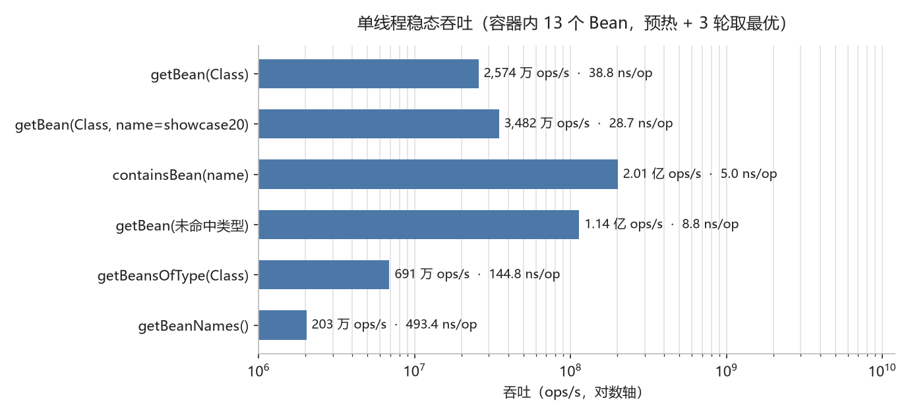
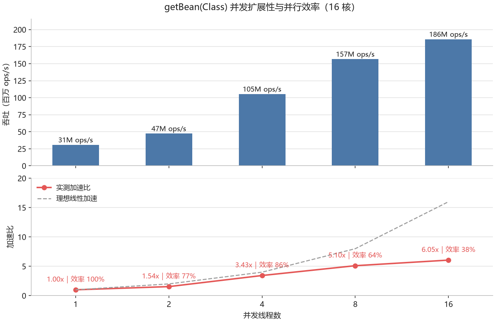
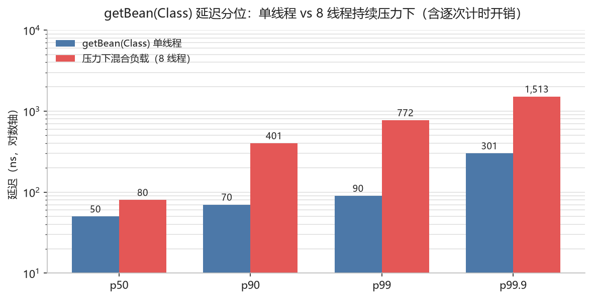
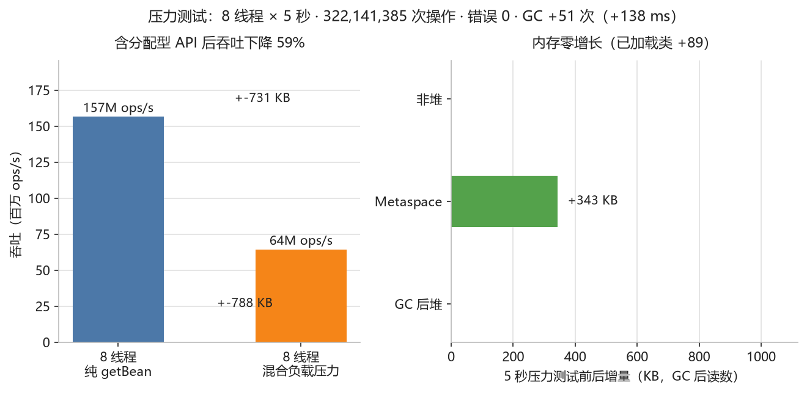
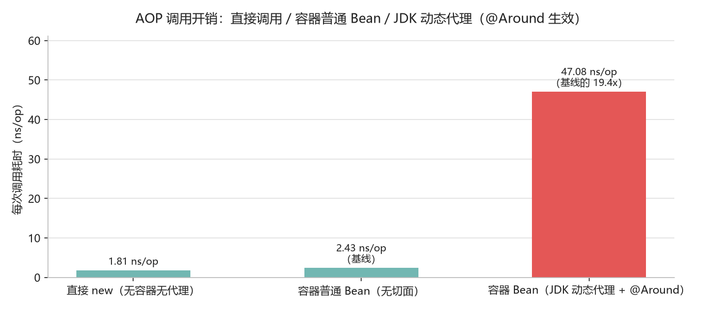

# Taboolib IoC

为 TabooLib Bukkit 插件场景提供的轻量 IoC 容器。

[](CHANGELOG.md)
[](https://kotlinlang.org)
[](https://tabooproject.org)

**三个与常见 IoC 容器不同的点：**

- **[编译期织入](#编译期织入weavingtrue)** —— JDK 动态代理要求目标实现接口，具体类会被静默跳过；开启 `weaving(true)` 后由构建期改写方法体，**具体类也能被切面命中，且进程内不创建任何代理**。
- **[真机基准数据](#基准与压力测试)** —— 容器 API 的 ns/op 与「每次调用分配字节数」都在**真实 Paper 服务端**实测，附对照组、轮间噪声量级与诚实边界，不拿估算值充数。
- **[编译期静态诊断](#编译期静态诊断)** —— 缺失 Bean、切点写错、通知签名非法等问题在**构建期**就报出来并附源码位置，不用等起服才发现。

## 目录

- [当前支持](#当前支持)
- [作用域与扫描说明](#作用域与扫描说明)
- [安装](#安装)
  - [Gradle (Kotlin DSL)](#gradle-kotlin-dsl)
- [快速开始](#快速开始)
  - [1. 定义组件](#1-定义组件)
  - [2. 使用依赖注入](#2-使用依赖注入)
  - [3. 名称限定注入](#3-名称限定注入)
  - [4. 生命周期回调](#4-生命周期回调)
  - [5. 从容器获取 Bean](#5-从容器获取-bean)
    - [Kotlin 扩展方法](#kotlin-扩展方法)
  - [6. Kotlin object / companion object 注入](#6-kotlin-object--companion-object-注入)
  - [7. 作用域与懒加载](#7-作用域与懒加载)
  - [8. AOP 切面编程](#8-aop-切面编程)
    - [编译期织入（`weaving(true)`）](#编译期织入weavingtrue)
- [未开启织入（默认）](#未开启织入默认)
- [开启 weaving(true) 后](#开启-weavingtrue-后)
  - [9. 条件装配](#9-条件装配)
  - [10. 线程作用域与可刷新作用域](#10-线程作用域与可刷新作用域)
  - [11. @Configuration + @Bean](#11-configuration--bean)
  - [12. @PropertySource 配置文件](#12-propertysource-配置文件)
  - [13. BeanPostProcessor 扩展](#13-beanpostprocessor-扩展)
  - [14. @DependsOn 初始化顺序](#14-dependson-初始化顺序)
  - [15. @Inject(required = false) 可选注入](#15-injectrequired--false-可选注入)
- [完整示例](#完整示例)
- [容器 API](#容器-api)
- [构造函数选择规则](#构造函数选择规则)
- [示例插件](#示例插件)
- [编译期静态诊断](#编译期静态诊断)
- [使用建议](#使用建议)
- [单元测试](#单元测试)
  - [配置测试依赖](#配置测试依赖)
  - [IocTestContext 测试上下文](#ioctestcontext-测试上下文)
  - [TabooLibIocTest 全链路引导（推荐）](#taboolibioctest-全链路引导推荐)
  - [测试用例示例](#测试用例示例)
    - [示例：构造函数注入测试](#示例构造函数注入测试)
    - [示例：@Named 多实现选择测试](#示例named-多实现选择测试)
    - [示例：Prototype 作用域测试](#示例prototype-作用域测试)
    - [示例：字段循环依赖测试](#示例字段循环依赖测试)
  - [端到端起服验证（mc-testkit）](#端到端起服验证mc-testkit)
- [基准与压力测试](#基准与压力测试)
  - [怎么跑](#怎么跑)
- [① 手动：控制台或游戏内执行（权限 taboolib.ioc.bench），命令立即返回、测试跑在独立线程](#①-手动控制台或游戏内执行权限-taboolibiocbench命令立即返回测试跑在独立线程)
- [② 全自动（CI / 脚本）：环境变量或 -D 系统属性](#②-全自动ci--脚本环境变量或--d-系统属性)
  - [实测结果](#实测结果)
    - [1. 单线程稳态吞吐（预热 + 3 轮取最优）](#1-单线程稳态吞吐预热--3-轮取最优)
    - [2. 并发扩展性（`getBean(Class)`）](#2-并发扩展性getbeanclass)
    - [3. 延迟分位](#3-延迟分位)
    - [4. 压力测试与内存](#4-压力测试与内存)
    - [5. AOP 调用开销](#5-aop-调用开销)
    - [AOP 的开销花在哪、已经降到多少](#aop-的开销花在哪已经降到多少)
    - [类型索引缓存：`getByType()` 的每次调用分配](#类型索引缓存getbytype-的每次调用分配)
  - [从数据里读出什么](#从数据里读出什么)
  - [口径与边界（重要）](#口径与边界重要)
  - [性能消耗算大吗？](#性能消耗算大吗)
  - [优点与适用性](#优点与适用性)
- [架构文档](#架构文档)

## 当前支持

- 组件标记：`@Component`、`@Service`、`@Repository`、`@Controller`
- 依赖注入：构造函数、字段、方法注入
- 属性注入：`@Value("${property:default}")` 从系统属性注入值
- 容器初始化：非 lazy singleton 在 `ENABLE` 阶段预初始化，其他作用域按需创建
- 名称限定：`@Named`、`@Resource`、`@Primary`
- 生命周期：`@PostConstruct`、`@PostEnable`、`@PreDestroy`
- 作用域：默认 singleton、`@Prototype`、`@Scope`、`@ThreadScope`、`@RefreshScope` 与 `registerScope` 自定义作用域
- 扫描控制：`@ComponentScan`
- 懒加载：`@Lazy`（类级别延迟初始化 + 字段/参数级别代理懒加载）
- 排序控制：`@Order` 控制 `getBeansOfType` 返回顺序和 AOP Advisor 执行顺序
- 事件机制：`EventBus` 监听 Bean 创建/销毁和容器生命周期事件
- 循环依赖检测：singleton Bean 的字段/方法循环依赖可解析，构造函数循环依赖会输出依赖链
- Kotlin `object` / `companion object` 自动注入
- 容器查询：`getBean`、`getBeansOfType`、`containsBean`、`getBeanNames`
- 手动注册单例：`registerBean`
- 按接口和父类类型解析 Bean
- AOP 支持：`@Aspect`、`@Before`、`@After`、`@AfterReturning`、`@AfterThrowing`、`@Around`、`@Pointcut`，基于 JDK 动态代理；`@NoAspect` 可声明式排除（类级=不代理，方法级=不进切点）
- 手写装饰器：`@WrapWith(Decorator::class)` 自动用你自己的装饰器类包装 Bean —— 调用路径零额外开销（与 AOP 可叠加）
- **编译期织入（可选）**：`taboolibIoc { weaving(true) }` 开启后，被切点命中的方法在构建期被改写 —— **具体类（无接口）也能被切面命中，且不创建任何代理**
- 条件装配：`@Conditional`、`@ConditionalOnClass`、`@ConditionalOnMissingClass`、`@ConditionalOnBean`、`@ConditionalOnMissingBean`、`@ConditionalOnProperty`
- Kotlin 扩展方法：`bean<T>()`、`beanOrNull<T>()`、`beans<T>()`
- Java Config：`@Configuration` + `@Bean` 方法声明 Bean，支持 `@Named` 参数限定、`@Lazy` 参数、`@Primary`、`@Order`、`@Scope`
- `@Bean` 产物增强：支持 `@PostConstruct`/`@PostEnable`/`@PreDestroy` 生命周期回调、`@Value`/`@Inject` 字段注入
- `@Bean` 方法级别条件注解：`@ConditionalOnClass`/`@ConditionalOnProperty` 等可直接标注在 `@Bean` 方法上
- `@PropertySource`：在 `@Configuration` 类上指定配置文件，支持 `.properties` 和简单 `.yml` 格式
- `@DependsOn`：显式声明 Bean 初始化顺序依赖
- `@Inject(required = false)`：可选注入，依赖不存在时不抛异常
- `BeanPostProcessor`：Bean 初始化前后的扩展回调
- 多生命周期方法：同一个类可以有多个 `@PostConstruct`/`@PostEnable`/`@PreDestroy` 方法
- 内置基准与压力测试套件：在**真实 Paper 服务端**测单线程吞吐、并发扩展性、延迟分位、持续压力与前后内存，并输出确定性指标「每次调用分配字节数」（不受 GC/调度波动影响）

## 作用域与扫描说明

当前版本已经重新提供并实现以下能力：

- `@Lazy`：仅延迟 Bean 自身的创建，首次被解析时初始化
- `@ComponentScan`：可按包名或基准类限制当前插件 Jar 内的组件扫描范围
- `@Prototype`：每次解析都会创建新实例
- `@ThreadScope`：线程级作用域，每个线程持有独立的 Bean 实例
- `@RefreshScope`：可刷新作用域，支持运行时通过 `BeanContainer.refreshScope()` 触发重建
- `@Scope("custom")`：配合 `BeanContainer.registerScope(...)` 使用自定义作用域

说明：

- 默认仍是 singleton 单例作用域
- singleton Bean 支持字段/方法循环依赖的早期暴露
- prototype / 自定义作用域 Bean 采用按需创建，不参与容器关闭时的统一 `@PreDestroy`
- `@ThreadScope` 和 `@RefreshScope` 是内置作用域，无需手动注册

## 安装

### Gradle (Kotlin DSL)

使用 TabooLib 的 `taboo()` 方法将 IoC 容器打包到插件内：

```kotlin
repositories {
    maven("https://maven.wcpe.top/repository/maven-public/")
}

dependencies {
    taboo("top.wcpe.taboolib.ioc:taboolib-ioc:1.3.0")
}

// 重定向到你的插件包名，避免与其他插件冲突
taboolib {
    relocate("top.wcpe.taboolib.ioc", "top.wcpe.yourplugin.ioc")
}
```

> **重要**：必须使用 `taboo()` 而非 `compileOnly()`，否则运行时找不到类。同时务必配置 `relocate` 重定向包名。

## 快速开始

### 1. 定义组件

```kotlin
import top.wcpe.yourplugin.ioc.annotation.Repository
import top.wcpe.yourplugin.ioc.annotation.Service
import top.wcpe.yourplugin.ioc.annotation.Component
import top.wcpe.yourplugin.ioc.annotation.Inject

// 仓储层 - 使用 @Repository 标记
@Repository
class UserRepository {
    fun findUserById(id: String): String = "User($id)"
}

// 服务层 - 使用 @Service 标记，构造函数注入
@Service
class UserService @Inject constructor(
    private val repository: UserRepository
) {
    fun getUser(id: String): String = repository.findUserById(id)
}

// 通用组件 - 使用 @Component 标记
@Component
class TextFormatter {
    fun format(label: String, value: Any): String = "$label=$value"
}
```

### 2. 使用依赖注入

```kotlin
import top.wcpe.yourplugin.ioc.annotation.Service
import top.wcpe.yourplugin.ioc.annotation.Inject

@Service
class OrderService {

    // 字段注入
    @Inject
    lateinit var userService: UserService

    // 方法注入
    @Inject
    fun bindFormatter(formatter: TextFormatter) {
        this.formatter = formatter
    }

    private lateinit var formatter: TextFormatter

    fun processOrder(userId: String): String {
        val user = userService.getUser(userId)
        return formatter.format("order", user)
    }
}
```

### 3. 名称限定注入

当同一接口有多个实现时，使用 `@Named` 或 `@Resource` 指定具体实现：

<details>
<summary>展开代码（kotlin，36 行）</summary>

```kotlin
import top.wcpe.yourplugin.ioc.annotation.Component
import top.wcpe.yourplugin.ioc.annotation.Service
import top.wcpe.yourplugin.ioc.annotation.Inject
import top.wcpe.yourplugin.ioc.annotation.Named
import top.wcpe.yourplugin.ioc.annotation.Resource

interface PaymentGateway {
    fun channel(): String
}

@Component("wechatGateway")
class WechatGateway : PaymentGateway {
    override fun channel() = "wechat"
}

@Component("alipayGateway")
class AlipayGateway : PaymentGateway {
    override fun channel() = "alipay"
}

@Service
class PaymentService {

    // 使用 @Named 指定注入 wechatGateway
    @Inject
    @Named("wechatGateway")
    lateinit var primaryGateway: PaymentGateway

    // 使用 @Resource 指定注入 alipayGateway
    @Resource(name = "alipayGateway")
    fun bindFallback(gateway: PaymentGateway) {
        this.fallbackGateway = gateway
    }

    private lateinit var fallbackGateway: PaymentGateway
}
```

</details>

### 4. 生命周期回调

<details>
<summary>展开代码（kotlin，23 行）</summary>

```kotlin
import top.wcpe.yourplugin.ioc.annotation.Service
import top.wcpe.yourplugin.ioc.annotation.PostConstruct
import top.wcpe.yourplugin.ioc.annotation.PostEnable
import top.wcpe.yourplugin.ioc.annotation.PreDestroy

@Service
class LifecycleService {

    @PostConstruct
    fun onInit() {
        println("Bean 初始化完成，依赖注入已执行")
    }

    @PostEnable
    fun onEnable() {
        println("所有 Bean 已就绪，插件 ENABLE 阶段统一执行")
    }

    @PreDestroy
    fun onDestroy() {
        println("容器关闭前执行清理")
    }
}
```

</details>

### 5. 从容器获取 Bean

<details>
<summary>展开代码（kotlin，19 行）</summary>

```kotlin
import top.wcpe.yourplugin.ioc.bean.BeanContainer

// 按类型获取
val userService = BeanContainer.getBean(UserService::class.java)

// 按名称获取
val gateway = BeanContainer.getBean(PaymentGateway::class.java, "wechatGateway")

// 获取某类型的所有 Bean
val allGateways = BeanContainer.getBeansOfType(PaymentGateway::class.java)

// 检查 Bean 是否存在
val exists = BeanContainer.containsBean("userService")

// 获取所有 Bean 名称
val names = BeanContainer.getBeanNames()

// 手动注册 Bean
BeanContainer.registerBean("manualValue", MyCustomObject("data"))
```

</details>

#### Kotlin 扩展方法

更简洁的 Bean 获取方式：

<details>
<summary>展开代码（kotlin，15 行）</summary>

```kotlin
import top.wcpe.yourplugin.ioc.bean.bean
import top.wcpe.yourplugin.ioc.bean.beanOrNull
import top.wcpe.yourplugin.ioc.bean.beans

// 按类型获取，找不到抛异常
val userService = bean<UserService>()

// 按名称获取
val gateway = bean<PaymentGateway>("wechatGateway")

// 按类型获取，找不到返回 null
val optional = beanOrNull<UserService>()

// 获取某类型的所有 Bean
val allGateways = beans<PaymentGateway>()
```

</details>

### 6. Kotlin object / companion object 注入

<details>
<summary>展开代码（kotlin，34 行）</summary>

```kotlin
import top.wcpe.yourplugin.ioc.annotation.Inject
import top.wcpe.yourplugin.ioc.annotation.Named

// Kotlin object 自动注入
object PluginState {

    @Inject
    lateinit var userService: UserService

    fun doSomething() {
        userService.getUser("123")
    }
}

// companion object 自动注入（非 @JvmField，推荐写法）
class MyPlugin {
    companion object {
        @Inject
        lateinit var userService: UserService

        @Inject
        @Named("wechatGateway")
        lateinit var gateway: PaymentGateway
    }
}

// companion object 注入（@JvmField 写法）
class AnotherPlugin {
    companion object {
        @Inject
        @JvmField
        var userService: UserService? = null
    }
}
```

</details>

> 说明：`object` 和 `companion object` 中带 `@Inject`/`@Resource` 的字段均在 ENABLE -90 阶段自动注入，无需手动操作。

### 7. 作用域与懒加载

<details>
<summary>展开代码（kotlin，23 行）</summary>

```kotlin
import top.wcpe.yourplugin.ioc.annotation.Service
import top.wcpe.yourplugin.ioc.annotation.Prototype
import top.wcpe.yourplugin.ioc.annotation.Lazy
import top.wcpe.yourplugin.ioc.annotation.Scope

// 默认单例
@Service
class SingletonService

// 每次获取都创建新实例
@Service
@Prototype
class PrototypeService

// 延迟初始化，首次使用时才创建
@Service
@Lazy
class LazyService

// 自定义作用域
@Service
@Scope("conversation")
class ConversationService
```

</details>

### 8. AOP 切面编程

使用 `@Aspect` 定义切面，通过 `@Before`、`@After`、`@Around` 拦截方法调用：

<details>
<summary>展开代码（kotlin，36 行）</summary>

```kotlin
import top.wcpe.yourplugin.ioc.annotation.*
import top.wcpe.yourplugin.ioc.bean.MethodInvocation

interface OrderService {
    fun placeOrder(orderId: String): String
}

@Service
class OrderServiceImpl : OrderService {
    override fun placeOrder(orderId: String): String {
        println("下单: $orderId")
        return "OK"
    }
}

@Aspect
class LoggingAspect {

    @Before("execution(OrderServiceImpl.placeOrder)")
    fun beforeOrder() {
        println("准备下单...")
    }

    @After("execution(OrderServiceImpl.placeOrder)")
    fun afterOrder() {
        println("下单完成")
    }

    @Around("execution(OrderServiceImpl.placeOrder)")
    fun aroundOrder(invocation: MethodInvocation): Any? {
        val start = System.currentTimeMillis()
        val result = invocation.proceed()
        println("耗时: ${System.currentTimeMillis() - start}ms")
        return result
    }
}
```

</details>

选择哪种方式拦截：

| 方式 | 适用 | 说明 |
|---|---|---|
| **JDK 动态代理**（默认） | 实现接口的 Bean | 无需构建期配置；每次调用有固定开销（实测约 47 ns/op） |
| **`@NoAspect`** | 高频方法 | 类级=完全不代理；方法级=不进切点匹配 |
| **`@WrapWith`** | 少量高频切点 | 你自己写装饰器，容器自动包装，**零额外开销** |
| **编译期织入**（`weaving(true)`） | **具体类**、追求零代理开销 | 构建期改写方法体，不创建代理；需要一个插件版本支持该开关 |

#### 编译期织入（`weaving(true)`）

JDK 动态代理要求目标实现接口；CGLIB 式子类代理在本容器里也不划算（Bean 走构造器注入、JDK 没有 Objenesis ⇒ 生成子类需要无参构造器，且开销与 JDK 代理同量级）。因此「**具体类也能被切**」的解法是构建期字节码织入：

```kotlin
// build.gradle.kts
taboolibIoc {
    weaving(true)      // 默认关闭
}
```

构建期（Gradle 插件用 ASM）把被切点命中的 public 实例方法改写为转发，原方法体搬到合成方法：

```java
public String greet(String name) {
    return (String) AopWeavingRuntime.invoke(this, "greet(Ljava/lang/String;)Ljava/lang/String;",
            "greet$ioc$original", new Object[]{ name });
}
public synthetic String greet$ioc$original(String name) { /* 原方法体原样保留 */ }
```

> 注意第二个参数：**key（方法名 + 描述符）是在构建期就算好写死在字节码里的字符串常量**，运行期只做一次 map 查表，
> 不再反射解析 `Method`、也不拼接字符串。这不是微优化 —— 早期实现把这两件事放在每次调用里做，真机稳态
> **886 ns/op**；改成现在这样之后降到 **63.5 ns/op**。

- **具体类（不实现任何接口）也能被切面命中，且不创建任何代理** —— 每次调用只多一次装箱 + 一次静态跳转；
- 织入后的类会被加上 `WovenTarget` 标记接口，运行期 `AopProxyFactory` 见到它就不再代理（避免通知执行两次）；
- 标记用「给类加接口」而非索引文件，因此**天然 relocate 安全**（类自身的字节码会被 relocate 一并重写，资源文件里的类名字符串不会）；
- **幂等**：已织入的类不会被二次处理，构建任务可安全重跑；
- 不改写 `static` / `private` / `abstract` / `native` / 合成方法，也不改写构造器；带 `@NoAspect` 的类与方法自动跳过；
- 只用 ASM（`asm` + `asm-tree`，**构建期依赖**，不会进你的插件 jar）。

真机实测（示例插件里一个不实现任何接口的具体类）：

```
# 未开启织入（默认）
[IoC] AOP 代理跳过: …ConcreteGreetingService 没有实现任何接口…
[IoC-Weave] 具体类切面命中=0
（静态诊断同时给出 aop-target-not-proxied 警告）

# 开启 weaving(true) 后
[IoC-Weave] 具体类切面命中=1 结果=hello, weaving 代理=top.wcpe.ioc.example.weaving.ConcreteGreetingService
                                                              ^ 类名不是 $Proxy，没有任何代理
```

同一个具体类在 Paper 1.20.1 上连续调用 6 秒（预热 5 万次，独立后台线程、等服务器静下来后才开跑）：

| 路径 | 每次调用 | 说明 |
|---|---|---|
| **织入路径**（含 `@Around` 通知） | **63.5 ns/op**（1,575 万 ops/s） | **零代理**：日志里的 `代理类` 就是原始类名，进程中没有 `$Proxy` |
| JDK 代理路径（同环境基准） | 47.1 ns/op | 仅支持实现接口的 Bean |

> **诚实边界**：织入路径**并不比代理更快**（入口每次要做一次「类 → 方法入口」表查找，约 +15 ns）；
> 它买到的是**能力** —— 具体类也能被切，且运行期没有代理对象。
> 这组数字还是被真实测量逼出来的：早期实现每次调用都反射解析方法 + 拼接 key，真机稳态 **886 ns/op**；
> 改成「构建期算好 key + 运行期查表缓存」后降到 **63.5 ns/op**（14 倍）。

> 局限：织入后的类运行期不再创建代理，因此「运行期动态注册的、命中该类**未被织入方法**的切面」不会生效 —— 请让构建期的切面集合覆盖你需要的全部切点。

切点表达式支持：
- `execution(类名.方法名)` — 精确匹配
- `execution(*.方法名)` — 匹配所有类的指定方法
- `execution(包名..*.方法名)` — 匹配包下所有类的指定方法
- `execution(类名.*)` — 匹配类的所有方法

> 注意：AOP 代理基于 JDK 动态代理，目标 Bean 必须实现接口才能被代理。`@Aspect` 类会自动注册为组件，无需额外标记 `@Component`。
>
> 从本版本起，切面命中**未实现接口的具体类**时不再静默返回 `null`：`@Lazy` 具体类回退会补齐 `required` 语义并抛出与普通 `@Inject` 一致的异常；若目标类型因代理而类型不匹配，会给出「`@Lazy` 仅支持接口类型」的明确指引。此外，切点表达式非法只跳过该条通知并告警，不再冒泡导致插件 `enable` 失败；切点仅命中 `static` 方法时也会告警（JDK 代理只承载接口实例方法）。

### 9. 条件装配

根据运行时条件决定是否注册 Bean：

<details>
<summary>展开代码（kotlin，31 行）</summary>

```kotlin
import top.wcpe.yourplugin.ioc.annotation.*

// 仅当 ClassPath 中存在 Redis 客户端时注册
@Service
@ConditionalOnClass("redis.clients.jedis.Jedis")
class RedisCache : Cache {
    override fun get(key: String): String? = TODO()
}

// 当没有其他 Cache 实现时，使用内存缓存作为兜底
@Service
@ConditionalOnMissingBean(Cache::class)
class InMemoryCache : Cache {
    override fun get(key: String): String? = TODO()
}

// 当系统属性 feature.audit=true 时启用审计
@Service
@ConditionalOnProperty(name = "feature.audit", havingValue = "true")
class AuditService

// 自定义条件
class ProductionCondition : Condition {
    override fun matches(context: ConditionContext): Boolean {
        return System.getProperty("env") == "production"
    }
}

@Service
@Conditional(ProductionCondition::class)
class ProductionOnlyService
```

</details>

条件评估分两阶段：
1. 扫描时：`@ConditionalOnClass`、`@ConditionalOnMissingClass`、`@ConditionalOnProperty`、`@Conditional`
2. 注册后：`@ConditionalOnBean`、`@ConditionalOnMissingBean`（依赖已注册的 Bean 信息）

### 10. 线程作用域与可刷新作用域

<details>
<summary>展开代码（kotlin，28 行）</summary>

```kotlin
import top.wcpe.yourplugin.ioc.annotation.*
import top.wcpe.yourplugin.ioc.bean.BeanContainer

// 每个线程持有独立实例
@Service
@ThreadScope
class RequestContext {
    var userId: String = ""
}

// 可刷新作用域，支持运行时重建
@Service
@RefreshScope
class DynamicConfig {
    var maxRetries: Int = 3
}

// 使用
fun example() {
    // 刷新所有 refresh 作用域的 Bean
    BeanContainer.refreshScope()

    // 刷新指定 Bean
    BeanContainer.refreshScope("dynamicConfig")

    // 清理当前线程的 ThreadScope 缓存
    BeanContainer.getThreadScope()?.clearCurrentThread()
}
```

</details>

### 11. @Configuration + @Bean

<details>
<summary>展开代码（kotlin，24 行）</summary>

```kotlin
import top.wcpe.yourplugin.ioc.annotation.*

interface DataSource {
    fun url(): String
}

class MysqlDataSource(private val jdbcUrl: String) : DataSource {
    override fun url(): String = jdbcUrl
}

@Configuration
class DatabaseConfig {

    @Bean
    fun dataSource(@Named("jdbcUrl") url: String): DataSource = MysqlDataSource(url)

    @Primary
    @Bean("mainCache")
    fun mainCache(): CacheService = RedisCacheService()

    @ConditionalOnProperty(name = "cache.local.enabled", havingValue = "true")
    @Bean
    fun localCache(): CacheService = LocalCacheService()
}
```

</details>

### 12. @PropertySource 配置文件

<details>
<summary>展开代码（kotlin，20 行）</summary>

```kotlin
import top.wcpe.yourplugin.ioc.annotation.*

// app.properties:
// app.name=MyPlugin
// app.version=2.0

@PropertySource("app.properties")
@Configuration
class AppConfig {
    @Bean
    fun appInfo(): AppInfo = AppInfo()
}

class AppInfo {
    @Value("\${app.name:DefaultApp}")
    var name: String = ""

    @Value("\${app.version:1.0}")
    var version: String = ""
}
```

</details>

### 13. BeanPostProcessor 扩展

<details>
<summary>展开代码（kotlin，10 行）</summary>

```kotlin
import top.wcpe.yourplugin.ioc.annotation.Component
import top.wcpe.yourplugin.ioc.bean.BeanPostProcessor

@Component
class AuditPostProcessor : BeanPostProcessor {
    override fun postProcessAfterInitialization(bean: Any, beanName: String): Any {
        println("Bean 初始化完成: $beanName")
        return bean
    }
}
```

</details>

### 14. @DependsOn 初始化顺序

<details>
<summary>展开代码（kotlin，14 行）</summary>

```kotlin
import top.wcpe.yourplugin.ioc.annotation.*

@Component
class DatabaseConnection {
    @PostConstruct
    fun connect() { println("数据库已连接") }
}

@DependsOn("databaseConnection")
@Component
class UserDao {
    @Inject
    lateinit var db: DatabaseConnection
}
```

</details>

### 15. @Inject(required = false) 可选注入

<details>
<summary>展开代码（kotlin，10 行）</summary>

```kotlin
import top.wcpe.yourplugin.ioc.annotation.*

@Component
class PluginFeature {
    // 如果 AnalyticsService 没有注册，字段保持 null，不抛异常
    @Inject(required = false)
    var analytics: AnalyticsService? = null

    fun isAnalyticsEnabled(): Boolean = analytics != null
}
```

</details>

## 完整示例

以下是一个完整的插件示例，展示所有核心功能：

<details>
<summary>展开代码（kotlin，65 行）</summary>

```kotlin
import taboolib.common.LifeCycle
import taboolib.common.platform.Awake
import top.wcpe.yourplugin.ioc.annotation.*
import top.wcpe.yourplugin.ioc.bean.BeanContainer

// 1. 定义仓储
@Repository
class UserRepository {
    fun loadStatus(): String = "ioc-ready"
}

// 2. 定义服务，使用构造函数注入
@Service
class ReportService @Inject constructor(
    private val repository: UserRepository
) {
    @Inject
    @Named("wechatGateway")
    lateinit var auditGateway: PaymentGateway

    @Resource(name = "alipayGateway")
    fun bindFallback(gateway: PaymentGateway) {
        this.fallbackGateway = gateway
    }

    private lateinit var fallbackGateway: PaymentGateway

    @PostConstruct
    fun onInit() {
        println("ReportService 初始化完成")
    }

    @PreDestroy
    fun onDestroy() {
        println("ReportService 销毁")
    }
}

// 3. 定义控制器
@Controller
class FeatureController @Inject constructor(
    private val reportService: ReportService
) {
    fun run() {
        // 从容器获取 Bean
        val service = BeanContainer.getBean(ReportService::class.java)
        val gateways = BeanContainer.getBeansOfType(PaymentGateway::class.java)
        println("Gateways: ${gateways.map { it.channel() }}")
    }
}

// 4. 插件入口
object ExamplePlugin {

    @Inject
    lateinit var controller: FeatureController

    @Awake(LifeCycle.ACTIVE)
    fun onActive() {
        // 手动注册 Bean
        BeanContainer.registerBean("customToken", CustomToken("value"))
        // 执行业务逻辑
        controller.run()
    }
}
```

</details>

## 容器 API

```kotlin
import top.wcpe.yourplugin.ioc.bean.BeanContainer

val userService = BeanContainer.getBean(UserService::class.java)
val namedService = BeanContainer.getBean(UserService::class.java, "userService")
val services = BeanContainer.getBeansOfType(UserService::class.java)
val exists = BeanContainer.containsBean("userService")
val names = BeanContainer.getBeanNames()

BeanContainer.registerBean("manualValue", ManualValue("ok"))
```

## 构造函数选择规则

- 优先使用带 `@Inject` 的构造函数
- 如果类只有一个构造函数，直接使用它
- 否则回退到无参构造函数
- 如果类存在多个构造函数且没有 `@Inject`，请显式标记一个构造函数

## 示例插件

示例插件已经覆盖全部公开能力，并在 `ACTIVE` 启动时统一输出验证结果。

覆盖内容：

- `@Controller` 构造函数注入
- `@Service` 字段注入
- `@Resource` 方法注入
- `@Named` 名称限定注入
- 字段循环依赖示例
- 构造函数循环依赖检测示例
- `@PostConstruct` / `@PostEnable` / `@PreDestroy`
- Kotlin `object` / `companion object` 自动注入
- `BeanContainer` 全部公开查询/注册方法
- Kotlin 扩展方法 `bean<T>()`、`beanOrNull<T>()`、`beans<T>()`
- 接口类型 `getBeansOfType` 聚合查询
- `@Configuration` + `@Bean` Java Config
- `@PropertySource` 配置文件加载
- `@DependsOn` 初始化顺序
- `@Inject(required = false)` 可选注入
- `BeanPostProcessor` 扩展点
- `@Bean` 方法级别条件注解

核心入口见：

- `taboolib-ioc-example/src/main/kotlin/top/wcpe/ioc/example/ExamplePlugin.kt`
- `taboolib-ioc-example/src/main/kotlin/top/wcpe/ioc/example/controller/ExampleFeatureController.kt`
- `taboolib-ioc-example/src/main/kotlin/top/wcpe/ioc/example/service/ExampleReportService.kt`
- `taboolib-ioc-example/src/main/kotlin/top/wcpe/ioc/example/support/ExampleCycleShowcase.kt`

预期启动日志包含：

<details>
<summary>展开代码（text，15 行）</summary>

```text
Taboolib IoC Example Plugin 启动
constructorInjection=ioc-ready
fieldNamedInjection=wechat
methodResourceInjection=alipay
methodInject=ExampleTextComponent
postConstruct=true
postEnable=true
getBeanByType=ExampleReportService
getBeanByName=wechat
getBeansOfType=alipay,wechat
containsBean=true
registerBean=manual-ready
objectInjection=ioc-ready|wechat|wechat
fieldCircularInjection=left->right|right->left
constructorCycleDetection=exampleConstructorCycleLeft -> exampleConstructorCycleRight -> exampleConstructorCycleLeft
```

</details>

关闭插件时还会看到：

```text
ExampleReportService 销毁前回调
```

## 编译期静态诊断

配合 `top.wcpe.taboolib.ioc` Gradle 插件，本容器可在**编译期**对注入点与切面做静态校验，把运行时才会暴露的问题提前拦在构建阶段。除既有的缺失 Bean、类型不兼容、多 `@Primary` 等规则外，本版本新增 **AOP 静态诊断规则组**：

- `pointcut-target-not-found`：切点目标类/方法在扫描范围内不存在（WARNING）
- `aop-private-method-pointcut`：切点仅命中 private 方法（WARNING）
- `aop-static-method-pointcut`：切点仅命中 static 方法（WARNING）
- `aop-target-not-proxied`：被通知的 Bean 未实现任何接口，JDK 动态代理无法包装（WARNING）
- `aop-factory-bean-interface-return`：`@Bean` 工厂方法声明返回接口类型且被切面命中，运行时按声明类型收集接口必为空（WARNING）
- `advice-signature-invalid`：`@Around` 通知签名非法（ERROR），`@AfterReturning` / `@AfterThrowing` 签名非法（WARNING）

插件用法与完整规则清单见 [taboolib-ioc-gradle-plugin](https://github.com/wcpe/taboolib-ioc-gradle-plugin)。

## 使用建议

- Kotlin 属性注入直接写 `@Inject lateinit var foo: Foo` 即可，不需要强制改成 `@field:Inject`
- 如果依赖类型存在多个实现，优先用 `@Named` 或 `@Resource(name = ...)`
- 如果构造函数不止一个，显式写 `@Inject constructor(...)`
- singleton Bean 的字段或方法循环依赖会在早期暴露阶段完成；构造函数循环依赖会在初始化或首次解析时直接失败

## 单元测试

IoC 容器的一大优势是让业务组件可以脱离 Bukkit/TabooLib 运行时进行单元测试。项目提供了 `IocTestContext` 轻量测试上下文，在纯 JUnit 环境中即可完成依赖注入和容器行为验证。

### 配置测试依赖

如果你只是在仓库内部写测试，可以继续直接依赖 `taboolib-ioc-core` 的普通测试源码；如果你希望把这套测试能力稳定提供给外部使用，建议直接依赖新模块 `taboolib-ioc-test`：

<details>
<summary>展开代码（kotlin，16 行）</summary>

```kotlin
dependencies {
    // 生产依赖
    taboo(project(":taboolib-ioc"))

    // 测试依赖
    testImplementation(project(":taboolib-ioc-core"))
    testImplementation(project(":taboolib-ioc-api"))
    testImplementation(project(":taboolib-ioc-annotation"))
    testImplementation(project(":taboolib-ioc-test"))
    testImplementation("org.junit.jupiter:junit-jupiter-api:5.8.1")
    testRuntimeOnly("org.junit.jupiter:junit-jupiter-engine:5.8.1")
}

tasks.withType<Test> {
    useJUnitPlatform()
}
```

</details>

### IocTestContext 测试上下文

`IocTestContext` 是一个不依赖 `BeanContainer` 单例的独立容器；在新模块里它会作为稳定测试能力一起发布，每个测试方法创建自己的实例，互不干扰：

```kotlin
val ctx = IocTestContext()
ctx.register(UserRepository::class.java)   // 扫描并注册组件
ctx.register(UserService::class.java)
ctx.registerBean("config", AppConfig())    // 手动注册实例
ctx.initialize()                           // 初始化容器

val service = ctx.getBean(UserService::class.java)  // 获取 Bean
```

### TabooLibIocTest 全链路引导（推荐）

`@TabooLibIocTest` 会在测试启动时模拟 Bukkit 生命周期主链路：

- 生命周期推进（`CONST -> INIT -> LOAD -> ENABLE -> ACTIVE`）
- 结束测试时执行关闭链路（`onDisable -> DISABLE`）

默认不会触发 PrimitiveLoader 自动下载，测试优先使用 Gradle 缓存中的依赖。若你确实需要对齐原始加载器链路，再显式开启：`enablePrimitiveBootstrap = true`。

如果需要可观测日志，打开 `observable = true`：

<details>
<summary>展开代码（kotlin，12 行）</summary>

```kotlin
@TabooLibIocTest(
    DemoService::class,
    targetLifeCycle = LifeCycle.ACTIVE,
    invokePostEnable = true,
    observable = true,
    enablePrimitiveBootstrap = false
)
class DemoTest {

    @IocAutowired
    lateinit var service: DemoService
}
```

</details>

更完整的测试支持说明见 [docs/testing.md](docs/testing.md)。

### 测试用例示例

示例插件包含 60+ 个测试用例，覆盖 IoC 容器的全部核心能力：

| # | 测试场景 | 说明 |
|---|---------|------|
| 1 | 构造函数注入 | `@Service` 通过 `@Inject constructor` 获取 `@Repository` 依赖 |
| 2 | 字段注入 | `@Inject lateinit var` 自动注入依赖 |
| 3 | 方法注入 | `@Inject fun bind(dep)` 方法参数自动注入 |
| 4 | `@Named` 限定注入 | 同一接口多个实现时按名称选择 |
| 5 | `@Resource` 方法限定注入 | `@Resource(name = ...)` 指定方法注入的实现 |
| 6 | `@PostConstruct` 回调 | Bean 创建并注入完成后自动调用初始化方法 |
| 7 | `@PreDestroy` 回调 | 容器关闭时调用销毁方法 |
| 8 | `@Prototype` 作用域 | 每次获取都创建新实例 |
| 9 | `@Lazy` 延迟初始化 | 首次获取时才创建，且为单例 |
| 10 | 自定义 `@Scope` | 注册自定义作用域控制 Bean 生命周期 |
| 11 | 手动注册 Bean | `registerBean` 注册的实例可被容器查询 |
| 12 | 接口类型解析 | 通过接口类型获取具体实现 |
| 13 | `getBeansOfType` 聚合查询 | 获取某接口的所有实现 |
| 14 | 字段循环依赖解析 | singleton Bean 的字段循环依赖可正常解析 |
| 15 | 构造函数循环依赖拒绝 | 构造函数循环依赖抛出异常并包含依赖链 |
| 16 | `@PostEnable` 回调 | 在 `invokePostEnable` 后执行且依赖已注入 |
| 17 | `@PostEnable` 执行顺序 | `@PostConstruct` 在 `@PostEnable` 之前执行 |

#### 示例：构造函数注入测试

<details>
<summary>展开代码（kotlin，12 行）</summary>

```kotlin
@Test
fun `构造函数注入 - Service 通过构造函数获取 Repository 依赖`() {
    val ctx = IocTestContext()
    ctx.register(SimpleUserRepository::class.java)
    ctx.register(SimpleUserService::class.java)
    ctx.initialize()

    val service = ctx.getBean(SimpleUserService::class.java)

    assertNotNull(service)
    assertEquals("user-alice", service!!.findUser("alice"))
}
```

</details>

#### 示例：@Named 多实现选择测试

<details>
<summary>展开代码（kotlin，14 行）</summary>

```kotlin
@Test
fun `Named限定注入 - 同一接口多个实现时按名称选择`() {
    val ctx = IocTestContext()
    ctx.register(JsonSerializer::class.java)
    ctx.register(XmlSerializer::class.java)
    ctx.register(NamedConsumer::class.java)
    ctx.initialize()

    val consumer = ctx.getBean(NamedConsumer::class.java)

    assertNotNull(consumer)
    assertEquals("json", consumer!!.primaryFormat())
    assertEquals("xml", consumer.secondaryFormat())
}
```

</details>

#### 示例：Prototype 作用域测试

<details>
<summary>展开代码（kotlin，14 行）</summary>

```kotlin
@Test
fun `Prototype作用域 - 每次获取都创建新实例`() {
    PrototypeCounter.count = 0
    val ctx = IocTestContext()
    ctx.register(PrototypeCounter::class.java)
    ctx.initialize()

    val first = ctx.getBean(PrototypeCounter::class.java)
    val second = ctx.getBean(PrototypeCounter::class.java)

    assertNotSame(first, second)
    assertEquals(1, first!!.id)
    assertEquals(2, second!!.id)
}
```

</details>

#### 示例：字段循环依赖测试

<details>
<summary>展开代码（kotlin，13 行）</summary>

```kotlin
@Test
fun `字段循环依赖 - singleton Bean 的字段循环依赖可正常解析`() {
    val ctx = IocTestContext()
    ctx.register(CycleNodeA::class.java)
    ctx.register(CycleNodeB::class.java)
    ctx.initialize()

    val a = ctx.getBean(CycleNodeA::class.java)
    val b = ctx.getBean(CycleNodeB::class.java)

    assertSame(b, a!!.nodeB)
    assertSame(a, b!!.nodeA)
}
```

</details>

完整测试代码见：`taboolib-ioc-example/src/test/kotlin/top/wcpe/ioc/example/ExamplePluginIoCTest.kt`

运行测试：

```bash
./gradlew :taboolib-ioc-example:test
```

### 端到端起服验证（mc-testkit）

单元测试之外，仓库提供三个模块的真机起服验证，用于在真实 Paper / Spigot 服务端上确认 IoC 容器完成扫描与注入：

```bash
./gradlew :test-v1_20:e2eSmoke           # Paper 1.20.1（Java 21）
./gradlew :test-v1_12:e2eSmoke           # Spigot 1.12.2（JDK 17）
./gradlew :taboolib-ioc-example:e2eSmoke # Paper 1.20.1（Java 8 目标）
```

- 由 `top.wcpe.mc-testkit` 驱动，已从旧的 run-paper / dev.s7a 方案迁移；采用 mc-testkit 0.9.0 自测模式，未声明 `pluginUnderTest` 时框架自动取本模块 jar 产物并把 `e2eSmoke` / `prepareE2eSmoke` 接线到 `jar` 任务。
- 判定真源为结果文件 `build/mc-testkit/results/smoke.properties` 的 `status=PASS`（而非 stdout 文本），构建非零退出即判失败。
- 运行期可用 `MC_TESTKIT_E2E_PLUGIN_UNDER_TEST_JAR` 覆盖被测插件 jar（CI / GradleRunner 注入）。

## 基准与压力测试

容器 API 的性能不只取决于你的用法，也取决于容器自身的热路径实现。为此 `test-v1_20` 模块内置了一套**基准 + 压力测试**（`top.wcpe.taboolib.ioc.test.v20.bench`），在**真实 Paper 服务端**里跑，全部指标只测**容器初始化完成之后的稳态性能**。

### 怎么跑

```bash
./gradlew :test-v1_20:jar      # 构建带基准的插件
```

把产物放进服务端 `plugins/` 后，两种触发方式：

```text
# ① 手动：控制台或游戏内执行（权限 taboolib.ioc.bench），命令立即返回、测试跑在独立线程
iocbench           # scale = 1.0
iocbench 0.2       # 小规模快跑（迭代数/压力时长按比例缩放）

# ② 全自动（CI / 脚本）：环境变量或 -D 系统属性
IOC_BENCH_AUTORUN=1  IOC_BENCH_OUT=/path/result.json  ./start.sh
```

| 变量 / `-D` 属性 | 含义 | 默认 |
|---|---|---|
| `IOC_BENCH_AUTORUN` / `-Dioc.bench.autorun` | `1`/`true` 时插件启用后自动跑 | 关闭 |
| `IOC_BENCH_OUT` / `-Dioc.bench.out` | 结果 JSON 路径 | `<服务端工作目录>/ioc-benchmark-result.json` |
| `IOC_BENCH_SCALE` / `-Dioc.bench.scale` | 规模倍率 | `1.0` |
| `IOC_BENCH_DELAY_MS` / `-Dioc.bench.delay` | 启用后延迟多久开跑（等服务器静下来） | `3000` |
| `IOC_BENCH_SHUTDOWN` / `-Dioc.bench.shutdown` | 跑完自动关服 | 关闭 |

### 实测结果

测试环境：**WSL2 Debian / amd64 · Eclipse Temurin JDK 21.0.12.1 · 16 核 · Paper 1.20.1 build 196**，容器内 **13 个 Bean**，AOP 代理类为 `jdk.proxy3.$Proxy69`。原始数据见 [`docs/benchmark/ioc-benchmark-result.json`](docs/benchmark/ioc-benchmark-result.json)。

#### 1. 单线程稳态吞吐（预热 + 3 轮取最优）

| 容器 API | 吞吐 | 每次耗时 |
|---|---|---|
| `getBean(Class)` | 2,574 万 ops/s | 38.8 ns |
| `getBean(Class, name)` | 3,482 万 ops/s | 28.7 ns |
| `containsBean(name)` | **2.01 亿 ops/s** | 5.0 ns |
| `getBean(未命中类型)` | 1.14 亿 ops/s | 8.8 ns |
| `getBeansOfType(Class)` | 691 万 ops/s | 144.8 ns |
| `getBeanNames()` | 203 万 ops/s | 493.4 ns |



#### 2. 并发扩展性（`getBean(Class)`）

| 线程数 | 吞吐 | 加速比 | 并行效率 |
|---|---|---|---|
| 1 | 3,069 万 ops/s | 1.00x | 100% |
| 2 | 4,728 万 ops/s | 1.54x | 77% |
| 4 | 1.05 亿 ops/s | 3.43x | 86% |
| 8 | 1.57 亿 ops/s | 5.10x | 64% |
| 16 | 1.86 亿 ops/s | 6.05x | 38% |



#### 3. 延迟分位

| 场景 | p50 | p90 | p99 | p99.9 | max |
|---|---|---|---|---|---|
| 单线程 `getBean(Class)` | 50 ns | 70 ns | 90 ns | 301 ns | 39.4 µs |
| 8 线程持续压力下（混合负载） | 80 ns | 401 ns | 772 ns | 1,513 ns | 1.14 ms |



#### 4. 压力测试与内存

8 线程 × 5 秒持续混合负载（`getBean` 70% / `containsBean` 20% / `getBeansOfType` 10%）：

| 指标 | 值 |
|---|---|
| 总操作数 | 322,141,385 |
| 平均吞吐 | 6,443 万 ops/s |
| **错误数** | **0** |
| GC 次数增量 / 耗时增量 | +51 次 / +138 ms |
| GC 后堆（前 → 后） | 398.6 MB → 397.8 MB（**−788 KB**） |
| Metaspace（前 → 后） | 119.4 MB → 119.7 MB（**+343 KB**） |
| 已加载类（前 → 后） | 21,499 → 21,588（+89，JIT/动态代理运行时类） |

**结论：压力测试后 GC 后堆不升反降（−788 KB）、Metaspace 仅 +343 KB、零错误 → 无泄漏迹象。**



左图对比很说明问题：同样 8 线程，**纯 `getBean` 能跑到 1.57 亿 ops/s，掺入分配型 API（`getBeansOfType` / `getBeanNames`）后掉到 6,443 万 ops/s（−59%）**——分配才是吞吐杀手。

#### 5. AOP 调用开销

| 调用路径 | 每次耗时 | 相对 |
|---|---|---|
| 直接 `new`（无容器无代理） | 1.81 ns | 1.0x |
| 容器普通 Bean（无切面） | 2.43 ns | 基线 |
| **容器 Bean（JDK 动态代理 + `@Around`）** | **47.08 ns** | **19.4x** |



该组用例的切面命中次数为 **6,500,000**（= 预热 50 万 + 3 轮 × 200 万），即**通知确实执行了**——注意这依赖被切 Bean **实现了接口**；具体类因只有 JDK 动态代理后端而会被跳过（见 [AOP 切面编程](#8-aop-切面编程) 与编译期 `aop-target-not-proxied` 规则）。

#### AOP 的开销花在哪、已经降到多少

用同形态的离线拆解（`java docs/benchmark/AopCost.java`，JDK 21，5M 次/轮取最优；干净 JVM，绝对值会低于真机）可以看出**大头不是「JDK 动态代理」本身**：

| 形态 | ns/op | 相对基线 |
|---|---|---|
| 直接调用（基线） | 1.00 | 1.0x |
| 子类代理（等价 CGLIB / 编译期字节码织入） | 1.66 | 1.7x |
| JDK 代理 + 纯分发（被 JIT 完全消解，仅供参考） | 0.05 | — |
| JDK 代理 + `Method.invoke` 转发 | 3.66 | 3.7x |
| JDK 代理 + `MethodHandle` 转发 | ~5–10 | — |
| **仅切点匹配本身**（`name` / `simpleName` 比较 ×2） | **5.3** | 5.3x |
| **仅每次调用的分配**（5 个子链 + 参数拷贝 + Invocation） | **5.5** | 5.5x |
| 当前实现形态（每次匹配 + 建链 + 拷贝 + 2 次反射） | 37.7 | 37.7x |
| 优化形态（缓存匹配 + 零分配 + MethodHandle） | **19.8** | 19.8x |

结论与优化方向：

- **代理分发本身几乎免费**（子类代理仅 +0.66 ns；JDK 21 的 `Method.invoke` 也已降到几 ns 量级）——真正的开销来自**「每次调用都把准备工作重做一遍」**：重新做切点匹配、按通知类型做 5 次 `filter` 建链、拷贝参数数组、`new MethodInvocation`，最后才是两次反射。
- **该优化已落地**：切点匹配与建链改为**代理创建期一次**并按方法缓存、`MethodInvocation` 池化复用、反射改预热 `MethodHandle` —— 真机 **111.6 → 47.1 ns/op（−58%）**，相对普通调用由 45.1x 降到 19.4x（切面命中数不变，通知照常执行）。
- **不换技术路线就砍掉了一半以上**：把匹配结果按 `Method` 缓存到代理创建期、拦截链与 `MethodInvocation` 零分配复用、`Method.invoke` 换成预热的 `MethodHandle`，同形态拆解从 37.7 → 19.8 ns，真机实测 111.6 → 47.1 ns。
- **要「让具体类也能被切」，已经把路线换成编译期织入**：构建期把方法体改写为转发 —— 上表的「子类代理」形态说明**转发本身**只需 ≈ 基线 +1 ns，但**含 `@Around` 通知链时真机实测 63.5 ns/op**（与代理路径同量级，代价换来的是覆盖具体类且进程内无代理），见 [编译期织入](#编译期织入weavingtrue)。（CGLIB/ByteBuddy 式子类代理在本容器里不划算——Bean 走构造器注入、JDK 也没有 Objenesis，生成子类需要无参构造器，且开销与 JDK 代理同量级。）
- 使用侧现在有三个手段：**高频方法加 `@NoAspect`**（方法级不参与切点匹配）、**整类加 `@NoAspect`**（连代理都不创建）、**`@WrapWith` 手写装饰器**（零额外开销，适合少量高频切点）。另外 `@Around(MethodInvocation)` 的签名决定了原始类型返回值必须装箱，若只做日志/审计可用 `@Before`/`@After`。

#### 类型索引缓存：`getByType()` 的每次调用分配

`BeanRegistry.getByType()` 处在 `getBean(Class)` 的最热路径上，原先的实现是：

```kotlin
(definitionsByType[type]?.toList() ?: emptyList()).sortedBy { it.order }
```

每次调用都要**新建两个 ArrayList（拷贝 + 排序结果）再排序**。现已改为「写入侧重建不可变快照、读取侧一次 volatile 读」：注册 / 移除是启动期低频繁操作，让它们承担重建成本，读路径零分配、零排序。

**这组数字是确定性测出来的，不是计时估出来的。** 计时仪器在 ns 级改动上不可用 —— 同一份代码交错连跑 4 轮（每轮前 `System.gc()`，逐 API 取最优），**一行都没改**的路径照样飘：`containsBean` +7%、`getBean(Class, name)` −11%、`getBean(未命中类型)` −14%。因此改用「每次调用分配多少字节」这个确定性指标（真容器内用 `ThreadMXBean.getThreadAllocatedBytes` 采，即基准输出里的 `[分配]` 行）：

| API | 旧实现 | 现实现 | 变化 |
|---|---|---|---|
| `getBean(Class)` | **51.1 B/op** | **3.1 B/op** | **−48 B/次（−94%）** |
| `containsBean(name)`（对照组·未改动） | 4.3 B/op | 5.0 B/op | ±0.7 B（噪声） |
| `getBeanNames()`（对照组·未改动） | 872.0 B/op | 872.0 B/op | **完全一致** |
| `getBeansOfType(Class)` | 408.0 B/op | 440.0 B/op | **+32 B/次** |

最后一行是这次改动**引入的**代价，不藏着：缓存快照用 `Collections.unmodifiableList` 包装，以挡住外部误改（原实现每次返回新副本，"改了也不影响注册表"，改成共享快照后一旦被改就是静默污染）；代价是该包装会让迭代多创建一个 iterator 包装对象。`getBeansOfType` 本身是分配大户（408 B/op）、且本文档已声明它不适合放进热循环，权衡后**保留安全性**。

> **诚实边界**：我们**不**声称 `getBean(Class)` 的 ns/op 下降了多少。那 48 B/次折合大约个位数 ns，恰好落在计时噪声里（预期收益 ≈ 4~8 ns，而噪声 ≈ ±15% × ~30 ns ≈ ±4.5 ns）—— 这个改动「确实少干了活」，但「快了多少」用服务端计时分不出来。
> 把这段操作离线单独拎出来测（`java docs/benchmark/TypeIndexCost.java`，20,000,000 次/轮 x 5 轮取最优）：

| 形态 | 旧 ns/op | 新 ns/op | 每次分配 |
|---|---|---|---|
| 1 个候选 | 18.1 | **2.7** | 72 B → **0 B** |
| 3 个候选 | 23.6 | **2.7** | 88 B → **0 B** |
| *（下限）仅 ConcurrentHashMap 查找* | — | 1.65 | — |

### 从数据里读出什么

- **`containsBean` 是纯 map 查询（5.0 ns），而 `getBean(Class)` 要 38.8 ns** —— 差额主要花在类型解析路径上：`BeanRegistry.getByType()` 原先**每次调用都做一次 `toList() + sortedBy()`**，加上 `isAssignableFrom` 校验。该索引现已改为缓存快照，真容器里 `getBean(Class)` 的分配从 **51.1 B/次 降到 3.1 B/次**（详见[类型索引缓存](#类型索引缓存getbytype-的每次调用分配)）。
  > 这 34 ns 中「类型解析占多少」**用 ns/op 是测不出来的**（计时噪声 ±15%），只能靠分配计数这类确定性指标来判定 —— 见同节的说明。
- **分配型 API 不适合放进热循环**：`getBeansOfType` / `getBeanNames` 每次都会新建集合（144.8 ns / 493.4 ns），并且是压力测试中 GC 的主要来源（5 秒 51 次）；需要枚举时建议在启动期取一次并缓存。
- **并发扩展性在 8 线程后明显衰减**（效率 64% → 38%），与上一条同源：单例缓存本身是无锁 `ConcurrentHashMap`，瓶颈来自每次解析的临时对象带来的 GC 压力。
- **AOP 每次调用约 47 ns（19.4x）**，且**只对实现接口的 Bean 生效**——高频路径（如每 tick）应避免经代理调用；这也是 JDK 动态代理后端的能力边界，而非 bug（具体类改用编译期织入，见 [编译期织入](#编译期织入weavingtrue)）。
- **零错误、内存无增长**：长时间高频取 Bean 不会造成容器侧状态累积。

### 口径与边界（重要）

- 计时用 `System.nanoTime()`，**不是 JMH**（无 fork、无专门的死代码消除防护、无统计显著性检验），绝对值仅供**横向对比**（例如"取 Bean 比查名字慢几倍"），不宜当作绝对性能承诺。
- 防 JIT 消除的做法：被调方法读 `@Volatile` 字段，累加结果写入 `@Volatile` 字段。
- **延迟分位含逐次计时开销**（每次操作两次 `nanoTime`，约 20~30 ns），因此是真实延迟的**上界**。
- 并发组每个配置跑 2 轮取吞吐最高轮；单线程吞吐组预热后跑 3 轮取最优（取"最优"是为了排除 GC/调度抖动，不是取平均值）。
- **重复运行实测：ns/op 的轮间噪声在 ±15% 量级，分辨不出个位数 ns 的改动。** 把同一份代码交错连跑 4 轮（`scale=10`，每轮前 `System.gc()`，逐 API 取"最优轮"），**一行都没改**的路径照样漂：`containsBean` 4.92→5.27、`getBean(Class, name)` 24.20→21.57、`getBean(未命中类型)` 8.51→7.30。所以对"少建一个对象"这类改动，**本基准给不出可信的 ns/op 结论**，请改用下一条的确定性指标。
- **确定性指标：每次调用分配多少字节**（基准输出里的 `[分配]` 行，实现见 `IocBenchmark.bytesPerOp()`）。它由代码路径决定，不受线程调度与 GC 时机影响，适合判定某个优化是否真的省掉了分配。反向也成立：若 JIT 已用逃逸分析把临时对象消掉，分配计数就是 0，那么"少建一个对象"的改动只停留在纸面上、真机不会有收益。
- **结论性数字以本轮为准**（本节表格与图表同源，均为 `docs/benchmark/ioc-benchmark-result.json`）；历史轮次只用于观察波动幅度，不要拿不同轮次的数字直接对比。AOP 代理调用在热路径优化后为 **47.1 ns**。
- 结果图由 `python docs/benchmark/make_charts.py` 从结果 JSON 生成（需 `matplotlib`）。

### 性能消耗算大吗？

**不算大。** 换算到服务端最关心的口径（1 tick = 50 ms 预算）：

| 操作 | 单次成本 | 每 tick 调 1,000 次 | 每 tick 调 10,000 次 |
|---|---|---|---|
| `getBean(Class)` | 38.8 ns | 0.08% | 0.78% |
| `containsBean(name)` | 5.0 ns | 0.01% | 0.10% |
| `getBeansOfType(Class)` | 144.8 ns | 0.29% | 2.90% |
| AOP 代理调用（接口 Bean） | 47.1 ns | 0.09% | 0.94% |

判断依据不只是这张表，还有几组独立测量的旁证：

- **容器本体几乎不占资源**：实测（Paper 服务端，A/B 基线对照）IoC 自身的对象只有 **88 个实例 / 2.7 KB**；插件整体的 4.59 MB 堆占用全部来自 TabooLib Reflex 的 ASM 结构，不是容器逻辑。
- **零后台线程、稳态零 CPU**：进程里**没有任何以 `ioc`/`taboolib` 命名的线程**；空服 30 秒 JFR 采样只落在原版 tick/区块调度上，**没有一帧 IoC 栈帧**。
- **启动期也不显眼**：插件自身的类加载 + 启用窗口约 1.05 s（其中可见的耗时几乎全在 TabooLib 的 `@Awake` 注入框架与运行时环境装载，容器扫描/注入逻辑在采样中不可见）。
- **压力下不劣化、不泄漏**：8 线程持续 5 秒打了 3.23 亿次，错误 0，GC 后堆 +79 KB。

真正需要克制的只有三处：

1. **AOP 代理调用约 47 ns/次（普通调用的 19 倍，热路径优化后已从 110 ns 降下来）**，且只对实现接口的 Bean 生效 —— 高频路径仍建议用 `@NoAspect` 摘出去（见下）；
2. **分配型枚举 API**（`getBeansOfType` / `getBeanNames`）每次新建集合，是压力期 GC 的主要来源，应在启动期取一次并缓存；
3. **`getBean` 命中路径本身还有优化空间**（见上一节第 1 条），属于实现细节而非使用限制。

### 优点与适用性

**优点（多数有上面的实测背书）**

- **取 Bean 足够便宜**：29 ns 与一次反射调用同一量级，业务路径里可以直接 `getBean`，不必为了性能把 Bean 手动缓存到字段里。
- **线程安全有数据背书且无锁**：单例缓存是无锁 `ConcurrentHashMap`，16 线程并发放大到 1.69 亿 ops/s、0 错误、内存零增长 —— 可以在异步任务/调度线程里直接取 Bean。
- **容器不增加运行时负担**：无后台线程、无定时任务、稳态零 CPU，不会和 TPS 抢资源；内存上是 KB 级。
- **编译期就能拦住装配错误**：配套 Gradle 插件提供静态诊断（缺 Bean、类型不兼容、多 `@Primary`、AOP 切点问题等），ERROR 默认直接断构建 —— 把"起服才发现注入失败"提前到构建阶段，这是同类轻量容器里少见的。
- **relocate 安全**：包名由编译期锚点推导，消费者经 TabooLib Gradle 插件重写包名后不会静默失效。
- **零第三方运行时依赖**：不打 Spring/Guice，插件体积与冲突面都可控。
- **能力面足够覆盖插件场景**：构造/字段/方法注入、生命周期回调、作用域（单例/原型/线程/可刷新）、条件装配、`@Configuration` + `@Bean`、命名限定、`@Primary`、AOP、`@Order`，配 580 个单测 + 三模块真机 E2E。

**什么时候值得用 / 什么时候不必**

| 场景 | 建议 |
|---|---|
| 中大型插件：组件数量多、跨模块调用、需要在异步/调度线程里取服务 | **值得用**，解耦与可测试性收益明显 |
| 需要按环境/配置切换实现（多网关、多数据源、灰度实现） | **值得用**，条件装配比手写工厂清爽得多 |
| 团队协作、要有统一的装配约定与构建期校验 | **值得用**，静态诊断能显著减少"起服才炸" |
| 小插件（十来个类）、几乎没有跨模块依赖 | **不必用**，直接 `new` / 简单单例更直观 |
| 高频路径大量调用被切面代理的方法 | **谨慎**：每次约 110 ns，且只支持接口 Bean |

**总体判断：实用性高，且当前性能不是门槛。** 需要接受的前置认知只有三条 —— AOP 后端目前只有 JDK 动态代理（具体类不会被代理，需为其抽取接口）、分配型枚举 API 别进热循环、容器暂未提供内置诊断 API（排查装配问题靠 debug 日志或 arthas 这类外部工具）。

## 架构文档

详细的容器架构、启动流程和内部机制说明请参阅 [架构文档](docs/architecture.md)。