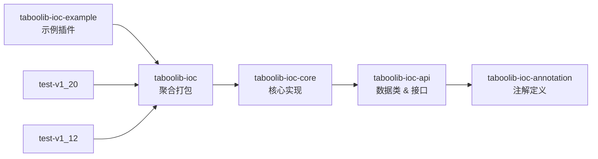
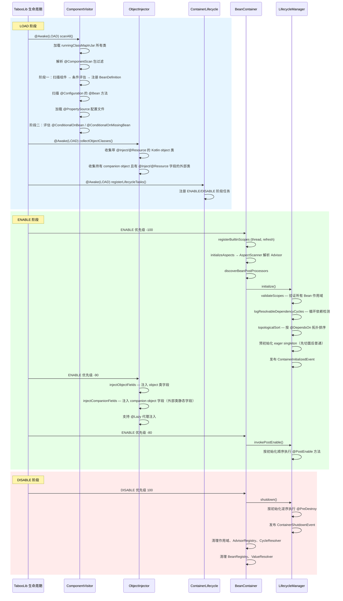
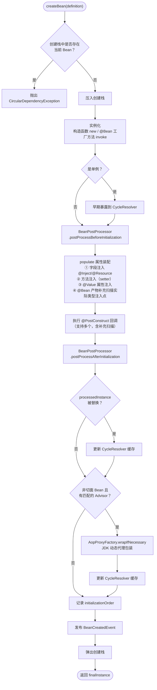
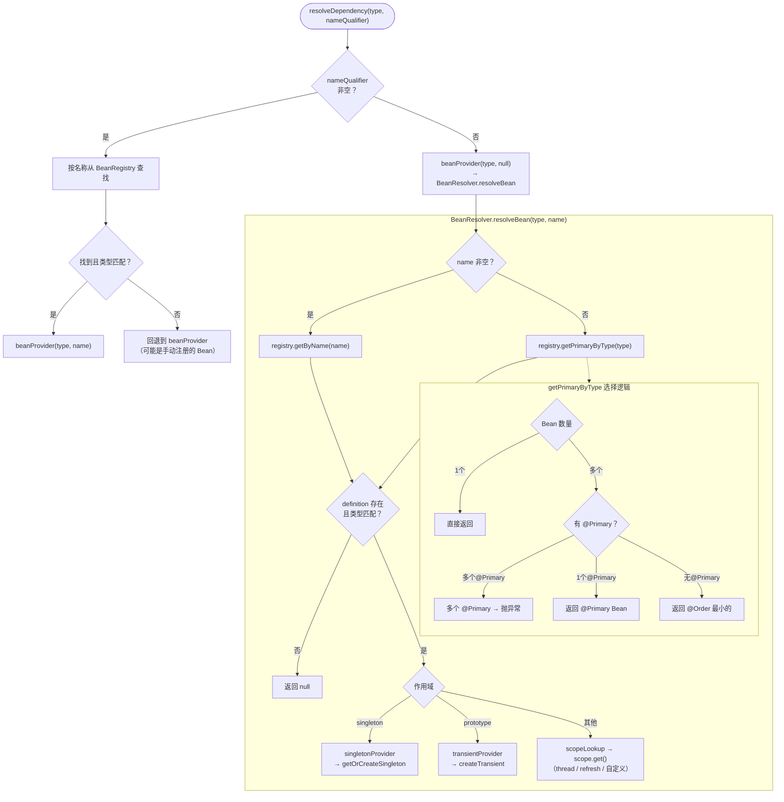

# taboolib-ioc 架构文档

> 版本：1.1.0 | TabooLib 6.2.x | Kotlin 1.9.25

---

## 目录

- [1. 模块结构与依赖关系](#1-模块结构与依赖关系)
- [2. 核心包职责](#2-核心包职责)
- [3. 容器启动时序](#3-容器启动时序)
  - [3.1 LOAD 阶段 — 组件扫描](#31-load-阶段--组件扫描)
  - [3.2 ENABLE -100 — 容器初始化](#32-enable--100--容器初始化)
  - [3.3 ENABLE -90 — Object 注入](#33-enable--90--object-注入)
  - [3.4 ENABLE -80 — PostEnable 回调](#34-enable--80--postenable-回调)
  - [3.5 DISABLE 100 — 容器关闭](#35-disable-100--容器关闭)
- [4. Bean 创建流程](#4-bean-创建流程)
- [5. 依赖解析流程](#5-依赖解析流程)
- [6. 条件装配机制](#6-条件装配机制)
- [7. AOP 代理机制](#7-aop-代理机制)
- [8. 作用域管理](#8-作用域管理)

---

## 1. 模块结构与依赖关系

```
taboolib-ioc-annotation   ← 38 个注解定义（零依赖）
taboolib-ioc-api           ← 15 个数据类/接口（依赖 annotation）
taboolib-ioc-core          ← 核心实现，26+ 个类（依赖 api）
taboolib-ioc               ← 聚合打包模块
taboolib-ioc-test          ← 对外发布的测试支撑模块
taboolib-ioc-example       ← 示例插件
test-v1_20 / test-v1_12    ← MC 版本集成测试
```



---

## 2. 核心包职责

| 包 | 核心类 | 职责 |
|---|---|---|
| `scan` | `ComponentVisitor`, `ClassScanner`, `ConfigurationScanner`, `ComponentScanPackages` | 类扫描、元数据解析、`@ComponentScan` 包过滤 |
| `bean` | `BeanContainer`, `BeanResolver`, `BeanRegistry`, `BeanContainerExtensions` | 容器主入口、Bean 查找与作用域解析 |
| `inject` | `Injector`, `FieldInjector`, `ConstructorResolver`, `ObjectInjector`, `LazyProxyFactory`, `ValueResolver` | 依赖注入（字段/构造函数/方法/@Value）、`@Lazy` 代理 |
| `lifecycle` | `LifecycleManager`, `ContainerLifecycle`, `EventBus` | 生命周期管理、TabooLib 生命周期集成、容器事件 |
| `cycle` | `CycleDetector`, `CycleResolver`, `CircularDependencyException` | 循环依赖检测、单例早期暴露 |
| `aop` | `AopProxyFactory`, `AdvisorRegistry`, `AspectScanner`, `InterceptorChain`, `JdkDynamicAopProxy` | AOP 代理（JDK 动态代理） |
| `condition` | `ConditionEvaluator`, `OnBeanCondition`, `OnClassCondition`, `OnMissingBeanCondition`, `OnMissingClassCondition`, `OnPropertyCondition` | 条件装配评估 |
| `scope` | `ThreadBeanScope`, `RefreshBeanScope` | 内置自定义作用域 |
| `util` | `KotlinPropertyAnnotations` | Kotlin 属性注解工具（处理 `$annotations` 合成方法） |

---

## 3. 容器启动时序

容器通过 TabooLib 的 `@Awake` 和 `registerLifeCycleTask` 机制集成到 Bukkit 插件生命周期中。



### 3.1 LOAD 阶段 — 组件扫描

入口：`ComponentVisitor.scanAll()`（`@Awake(LifeCycle.LOAD)`）

1. 从 `runningClassMapInJar` 加载 Jar 内所有类
2. 解析 `@ComponentScan` 注解，确定扫描包范围（`ComponentScanPackages.resolve`）
3. 按包名过滤候选类（`ComponentScanPackages.matches`）
4. 阶段一扫描：
   - 对每个候选类调用 `ClassScanner.scan()` 生成 `BeanDefinition`
   - 评估类级条件注解（`@ConditionalOnClass`、`@ConditionalOnMissingClass`、`@ConditionalOnProperty`、`@Conditional`）
   - 带 `@ConditionalOnBean` / `@ConditionalOnMissingBean` 的延迟到阶段二
   - 通过条件的注册到 `BeanRegistry`
   - 对 `@Configuration` 类：`ConfigurationScanner.scan()` 扫描 `@Bean` 方法，评估方法级条件注解后注册
   - 加载 `@PropertySource` 指定的配置文件到 `ValueResolver`
5. 阶段二扫描：
   - 评估延迟的 `@ConditionalOnBean` / `@ConditionalOnMissingBean`（此时 BeanRegistry 已有阶段一的注册结果）

同时，`ObjectInjector.collectObjectClasses()` 在 LOAD 阶段收集所有带 `@Inject`/`@Resource` 字段的 Kotlin `object` 类及持有 `companion object` 的外部类，并注册 ENABLE -90 的注入任务。

### 3.2 ENABLE -100 — 容器初始化

入口：`ContainerLifecycle` → `BeanContainer.initialize()`

```
registerBuiltinScopes (thread, refresh)
    ↓
initializeAspects — 创建切面 Bean 实例 → AspectScanner 解析 Advisor → 注册到 AdvisorRegistry
    ↓
discoverBeanPostProcessors — 发现并注册 BeanPostProcessor
    ↓
LifecycleManager.initialize()
    ├── validateScopes — 验证所有 BeanDefinition 的作用域是否已注册
    ├── logResolvableDependencyCycles — 对单例 Bean 做循环依赖检测（仅日志警告）
    ├── topologicalSort — 按 @DependsOn 声明拓扑排序
    ├── 预初始化 eager singleton（先切面 Bean 后普通 Bean）
    │   └── 对每个 Bean 调用 getOrCreateSingleton → createBean
    └── 发布 ContainerInitializedEvent
```

### 3.3 ENABLE -90 — Object 注入

入口：`ObjectInjector.injectObjectFields()`

- 遍历 LOAD 阶段收集的 Kotlin `object` 类，通过 `INSTANCE` 静态字段获取单例并注入
- 遍历 LOAD 阶段收集的持有 `companion object` 的外部类，获取 `Companion` 实例并注入外部类静态字段
- `companion object` 属性（无论 `@JvmField` 与否）的 backing field 均在外部类静态字段上
- 对每个 `@Inject`/`@Resource` 字段：
  - 带 `@Lazy`：通过 `BeanContainer.injectLazyObjectField()` → `FieldInjector.injectLazyField()` 创建 JDK 动态代理
  - 不带 `@Lazy`：直接调用 `BeanContainer.getBean()` 获取实例并注入

### 3.4 ENABLE -80 — PostEnable 回调

入口：`ContainerLifecycle` → `BeanContainer.invokePostEnable()` → `LifecycleManager.invokePostEnable()`

- 按 `initializationOrder`（Bean 创建顺序）遍历所有已初始化的 singleton
- 执行每个 Bean 的 `@PostEnable` 方法
- 对 `@Bean` 工厂方法产物，会补充扫描实际类型上的 `@PostEnable` 方法

### 3.5 DISABLE 100 — 容器关闭

入口：`ContainerLifecycle` → `BeanContainer.shutdown()`

```
LifecycleManager.shutdown()
    ├── 按 initializationOrder 逆序遍历 singleton
    ├── 执行每个 Bean 的 @PreDestroy 方法
    ├── 发布 BeanDestroyedEvent
    └── 发布 ContainerShutdownEvent
        ↓
清理 customScopes（调用每个 scope 的 clear()）
清理 AdvisorRegistry
清理 CycleResolver
清理 BeanRegistry
清理 manualBeansByName
清理 EventBus
清理 ValueResolver
```

---

## 4. Bean 创建流程

`LifecycleManager.createBean()` 是 Bean 实例化的核心方法，处理完整的创建-注入-初始化-代理流程。



实例化方式取决于 `BeanDefinition` 的类型：

| 类型 | 实例化方式 |
|---|---|
| 普通组件（`@Component`/`@Service`/`@Repository`/`@Controller`） | `ConstructorResolver` 选择构造函数 → `constructor.newInstance(args)` |
| `@Bean` 工厂方法产物 | 获取 `@Configuration` 类实例 → `factoryMethod.invoke(configInstance, args)` |

构造函数/工厂方法参数解析支持 `@Lazy` 延迟代理（通过 `LazyProxyFactory` 创建 JDK 动态代理）。

---

## 5. 依赖解析流程

依赖解析涉及两个层次：`FieldInjector.resolveDependency()` 负责入口路由，`BeanResolver.resolveBean()` 负责实际查找与作用域处理。



`BeanResolver` 还会检查 `manualBeansByName`（通过 `BeanContainer.registerBean()` 手动注册的 Bean），作为 `BeanRegistry` 查找的补充。

---

## 6. 条件装配机制

条件装配分两个阶段评估，由 `ConditionEvaluator` 统一协调：

| 阶段 | 评估的条件注解 | 时机 |
|---|---|---|
| 阶段一（扫描时） | `@Conditional`、`@ConditionalOnClass`、`@ConditionalOnMissingClass`、`@ConditionalOnProperty` | `ComponentVisitor.scanAll()` 扫描每个类/方法时 |
| 阶段二（注册后） | `@ConditionalOnBean`、`@ConditionalOnMissingBean` | 阶段一全部注册完成后，基于已注册的 BeanDefinition 评估 |

分两阶段的原因：`@ConditionalOnBean` 需要知道哪些 Bean 已经注册，因此必须等阶段一完成后才能评估。

条件注解可以标注在：
- 组件类上（`@Component`/`@Service`/`@Configuration` 等）
- `@Bean` 工厂方法上

---

## 7. AOP 代理机制

AOP 基于 JDK 动态代理实现，仅支持实现了接口的 Bean。

初始化流程：
1. `BeanContainer.initializeAspects()` — 找到所有 `isAspect=true` 的 BeanDefinition，创建切面实例
2. `AspectScanner.scan()` — 解析切面类中的 `@Before`/`@After`/`@AfterReturning`/`@AfterThrowing`/`@Around` 方法，生成 `Advisor` 列表
3. `AdvisorRegistry.registerAll()` — 注册所有 Advisor

代理包装：
- 在 `createBean` 的最后阶段，`AopProxyFactory.wrapIfNecessary()` 检查 Bean 是否有匹配的 Advisor
- 切面 Bean 自身不会被代理
- 匹配时通过 `JdkDynamicAopProxy` 创建代理，方法调用经过 `InterceptorChain` 执行通知链

---

## 8. 作用域管理

| 作用域 | 标识 | 实现类 | 行为 |
|---|---|---|---|
| singleton | `singleton` | 内置（`CycleResolver` 缓存） | 容器内唯一实例，预初始化 |
| prototype | `prototype` | 内置（每次 `createTransient`） | 每次请求创建新实例 |
| thread | `thread` | `ThreadBeanScope` | 线程级缓存，可通过 `getThreadScope().clear()` 清理 |
| refresh | `refresh` | `RefreshBeanScope` | 可刷新缓存，通过 `BeanContainer.refreshScope()` 触发 |
| 自定义 | 任意字符串 | 实现 `BeanScope` 接口 | 通过 `BeanContainer.registerScope()` 注册 |

作用域通过 `@Scope("name")` 或快捷注解（`@ThreadScope`、`@RefreshScope`、`@Prototype`）声明。标准作用域（singleton/prototype）不允许被覆盖。

`LifecycleManager.validateScopes()` 在容器初始化时验证所有 BeanDefinition 引用的作用域是否已注册，未注册则抛出异常。
